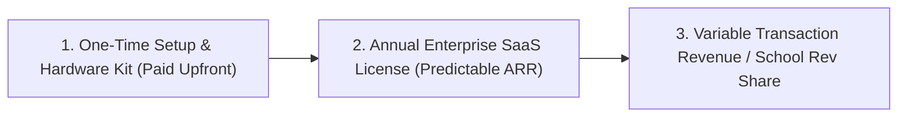

# 🏫 Smart School Food Court & Nutrition Platform
## Strategic Partnership Proposal, Enterprise Commercial Model & Multi-Persona Value Matrix

---

## 📌 1. Executive Summary

Modern K-12 private and international schools strive to deliver world-class infrastructure and holistic student wellness. However, **school recess and lunch breaks remain an operational bottleneck**:
- **Canteen Chaos & Lost Break Time:** Students spend 10–12 minutes of their 15-minute break standing in crowded canteen queues rather than eating and resting.
- **Cash Mishandling & Loss Risks:** Young students carrying physical cash leads to money loss, hygiene issues at food counters, and administrative friction.
- **Allergy & Health Blindspots:** Canteen staff lack real-time visibility into student medical allergies or parental dietary restrictions (e.g. nut, gluten, dairy sensitivity).
- **Kitchen Wastage & Inaccurate Demand:** Canteen vendors cook on guesswork, leading to 30–40% food wastage or premature stock-outs.

**The Solution:** An integrated, enterprise-grade **Smart School Food App** that connects **Parents**, **School Kitchens / Canteen Vendors**, and **School Administration** into a cashless, allergy-safe, pre-ordered meal ecosystem with real-time **Classroom Desk Delivery** and live tracking.

---

## 🎯 2. Multi-Persona Value Matrix & Feature Breakdown

| Persona | Core Pain Points Today | Platform Solutions & Key Features | Tangible Impact & ROI |
|---|---|---|---|
| **👨‍👩‍👧‍👦 Parents** | • Anxiety over whether children ate wholesome food.<br>• Managing lunch for 2–3 siblings in different grades.<br>• Carrying cash daily.<br>• Unaware of canteen hygiene or ingredient safety. | • **1-Tap Multi-Sibling Ordering:** Switch between children or copy wholesome lunch trays with 1 tap.<br>• **Active Allergen Shield:** Visual warnings & checkout prevention for flagged allergies (peanuts, gluten, dairy).<br>• **Meal Nutrition & Energy Bar:** Live calculation of calories (kcal) and protein (g) per meal.<br>• **Campus Lunch Wallet:** 1-tap instant checkout with zero gateway loading.<br>• **Live 5-Stage Kitchen Tracker:** Real-time updates from kitchen prep to classroom desk delivery.<br>• **Advance Break Pre-ordering:** Order up to 7 days ahead for Morning Snack or Lunch Break. | • 100% peace of mind.<br>• Zero daily morning rush.<br>• Complete visibility into child nutrition. |
| **🎒 Students** | • Long queues; losing entire recess time.<br>• Cash loss or money dropped in corridors.<br>• Missing favorite meals due to stock-outs. | • **Zero-Queue Classroom Desk Handover:** Fresh meal box delivered directly to classroom desk before the break bell.<br>• **Personalized Thermal Token Sticker:** Clearly labeled with Student Name, Class-Section, Roll #, and Token ID.<br>• Guaranteed hot, fresh meal reserved specifically for them. | • More time to eat calmly, hydrate, and socialize.<br>• Zero cash handling anxiety.<br>• Better classroom focus. |
| **👩‍🍳 Canteen & Kitchen Vendors** | • 30–40% food wastage due to unpredictable demand.<br>• Handling change and rush-hour counter congestion.<br>• Difficult to track special dietary requests. | • **Pre-Order Demand Forecasting:** Real-time summary of exact dish counts needed by cutoff time.<br>• **Live Kitchen Display System (KDS):** Filter tickets by break slot, batch cook, and update prep stages.<br>• **1-Click Thermal Batch Printing:** Automatic 80mm sticker printing sorted by Class & Section.<br>• **Instant Cashless Settlements:** Unified digital payout reports. | • Food wastage reduced by **35%+**.<br>• Operating margins increase by **20–25%**.<br>• 100% digitized order records. |
| **🏫 School Leadership & Management** | • Parent complaints about canteen quality & delays.<br>• Lack of health/FSSAI audit trails.<br>• Security risk of outside delivery drivers or student cash. | • **Enterprise School Admin Portal:** Complete campus oversight on active orders, break timings, and vendor performance.<br>• **Allergen & Hygiene Audit Trail:** Digital record of ingredient checks for every meal served.<br>• **Modern Campus Brand Differentiator:** Highlights school's tech-forward, student-first health standards.<br>• **Campus Revenue Share:** Direct monetization from vendor platform sales. | • Zero cash on campus.<br>• Enhanced school reputation.<br>• Predictable ancillary revenue stream. |
| **👩‍🏫 Class Teachers & Staff** | • Disruption during recess from students returning late.<br>• Food disputes and messy classrooms. | • **Classroom Crate Sorting:** Food boxes arrive pre-sorted in class delivery crates with bold, readable thermal stickers.<br>• Seamless desk distribution in under 60 seconds. | • On-time start of post-recess class periods.<br>• Clean, disciplined classroom environment. |

---

## 💰 3. Enterprise Commercial Model & Pricing Tiers

To eliminate implementation risk, ensure guaranteed cash flow from Day 1, and align incentives, our commercial structure is split into **three de-risked pillars**:



---

### 📦 Pillar 1: Mandatory Implementation, Setup & Hardware Kit (One-Time Upfront)
*Guarantees zero financial loss for setup, roster migration, training, and hardware deployment.*

| Package Tier | Campus Scope | Deliverables Included | One-Time Fee |
|---|---|---|---|
| **Starter Setup** | Up to 500 Students | • SIS / Student CSV Roster Migration & Class Mapping<br>• Break Timings & Canteen Menu Digitization with Allergen Tags<br>• **1x Dedicated Kitchen Touchscreen Tablet (10-inch)**<br>• **1x High-Speed 80mm Bluetooth Thermal Sticker Printer**<br>• **15x Water-Resistant Thermal Sticker Rolls (3,000 meals)**<br>• On-site Kitchen Staff Training & Trial Run<br>• Parent Launch Marketing Kit (WhatsApp & Email Circulars) | **₹45,000** *(One-Time)* |
| **Growth Setup** | 500 – 1,200 Students | • All Starter Setup deliverables for high-volume kitchen<br>• **1x Heavy-Duty Kitchen Tablet + 1x Thermal Printer**<br>• **25x Thermal Sticker Rolls (5,000 meals)**<br>• Priority On-Site Staff Training & Menu Photography Guide | **₹65,000** *(One-Time)* |
| **Enterprise Setup** | 1,200+ Students (Multi-Wing) | • Deliverables for **2 Separate Kitchen Counters / Wings**<br>• **2x Kitchen Tablets + 2x Thermal Printers + 50 Sticker Rolls**<br>• Custom School Domain & Single Sign-On (SSO) integration<br>• Dedicated On-Site Support Engineer for Launch Week | **₹95,000** *(One-Time)* |

---

### 🏢 Pillar 2: Annual Enterprise SaaS License (Predictable Software Revenue)

| Tier | Campus Size | Annual License Fee | Monthly Equivalent | Key Inclusions |
|---|---|---|---|---|
| **Starter Campus** | **Up to 500 Students** | **₹1,20,000 / year** | ₹10,000 / mo | Full Parent Portal, Admin Dashboard, Kitchen KDS, Sibling Management, Allergen Shield, Campus Lunch Wallet, Standard Support. |
| **Growth Campus** | **500 – 1,200 Students** | **₹1,95,000 / year** | ₹16,250 / mo | Everything in Starter + Co-Parent Sync, Multi-Slot Break Management, Custom Nutrition Badging, Priority Support (7 AM - 7 PM). |
| **Enterprise / Multi-Campus** | **1,200 – 2,500+ Students** | **₹2,85,000 / year** | ₹23,750 / mo | Everything in Growth + Multi-Wing Routing, Dedicated Account Manager, Custom ERP Webhook Sync, 99.9% SLA Guarantee. |

---

### 💳 Pillar 3: Transaction Model & School Revenue Share (Commercial Options)

Schools can choose from three commercial options based on who operates the canteen:

#### Option A: Hybrid Shared Model *(Most Popular)*
- **School License:** School pays the Annual SaaS License.
- **Transaction Commission:** 5% platform fee charged on canteen vendor GMV.
- **School Revenue Share:** School receives a **2.5% to 3.5% revenue share** on all canteen sales, creating a passive annual revenue stream of **₹2.5 Lakhs – ₹5 Lakhs/year** for the school.

#### Option B: Canteen Vendor-Funded Model *(Zero School Cost)*
- If the school does not wish to pay from its annual budget, the outsourced canteen contractor pays the setup and annual software fees as part of their commercial canteen contract.
- Canteen vendor recovers cost through a **35%+ reduction in food wastage** and higher student meal volume.

#### Option C: Pure Enterprise SaaS (0% Commission)
- School pays the Annual SaaS License; 100% of all food payments flow directly from parents to school/vendor bank account with 0% platform commission (standard bank PG gateway fees only).

---

## 🔒 4. Risk Mitigation & Milestone Payment Safeguards

To ensure complete financial protection and prevent unpaid effort:

```
[ Milestone 1: Agreement Signing ] ────────► 50% of Setup & 1st Year SaaS (Initiates Roster Import & Menu Setup)
[ Milestone 2: Hardware Delivery ] ────────► 30% (Upon Tablet & Thermal Printer Delivery & Staff Training)
[ Milestone 3: Go-Live Day ]      ────────► 20% Final Balance (Campus Public Launch)
```

> [!IMPORTANT]
> **Minimum Monthly Floor Guarantee:** For revenue-share / commission contracts, a minimum billing floor of **₹15,000 / month** applies during active school months, protecting platform revenue against seasonal fluctuations.

---

## 🛡️ 5. Data Privacy, Security & School Brand Integration

| Governance Pillar | Enterprise Standards Implemented | School Administration Value |
|---|---|---|
| **Data Privacy & Student Protection** | • Strict compliance with Indian Digital Personal Data Protection (DPDP) Act.<br>• Student medical/allergy data encrypted in transit and at rest.<br>• Zero commercial data monetization or third-party ads. | Complete compliance with school board safety guidelines. |
| **School Brand Co-Branding** | • School crest/logo, colors, and official name prominently featured.<br>• Custom campus vanity link (e.g. `food.brainwaves.edu.in`). | Reinforces school’s premium, tech-enabled campus identity. |
| **Frictionless Web-First Architecture** | • Progressive Web App (PWA) opens in 1 tap from WhatsApp/SMS.<br>• Zero mandatory 100MB app downloads for parents.<br>• Works across iOS, Android, Tablets, and Desktop browsers. | 95%+ parent adoption within the first 48 hours. |

---

## 📈 6. Financial Projection for a 1,000-Student School

| Parameter | Conservative (30% Adoption) | Target (50% Adoption) | High Engagement (70% Adoption) |
|---|---|---|---|
| **Daily Orders** | 300 meals/day | 500 meals/day | 700 meals/day |
| **Avg Order Value (AOV)** | ₹65 | ₹75 | ₹80 |
| **Monthly GMV (22 School Days)** | ₹4,29,000 | ₹8,25,000 | ₹12,32,000 |
| **Annual GMV (10 Academic Months)** | ₹42.9 Lakhs | ₹82.5 Lakhs | ₹1.23 Crores |
| **School Revenue Share (3% GMV)** | **₹1.29 Lakhs / yr** | **₹2.47 Lakhs / yr** | **₹3.69 Lakhs / yr** |
| **Canteen Waste Reduction Savings** | ~₹1.8 Lakhs / yr | ~₹3.2 Lakhs / yr | ~₹5.1 Lakhs / yr |

---

## 🚀 7. 3-Phase Implementation & Pilot Roadmap

```
[ Phase 1: Setup & Data Ingestion (Days 1–7) ]
├── Agreement signing & 50% Milestone 1 confirmation
├── Student SIS CSV roster & class-section mapping
└── Canteen menu digitization with allergen tagging & calorie indexing

[ Phase 2: Hardware Deployment & Kitchen Training (Days 8–14) ]
├── Delivery of Kitchen Tablet + 80mm Bluetooth Thermal Printer
├── Kitchen staff hands-on training on KDS batch workflow & sticker labeling
└── Pilot trial with Grade 4 & Grade 5 classes (50–100 test meals)

[ Phase 3: Campus-Wide Launch (Days 15+) ]
├── WhatsApp & Email circular broadcast to parents with 1-click web link
├── Live co-parent conflict detection & allergy safety active
└── Ongoing analytics, support, and monthly settlement reporting
```

---

## 🤝 8. Why Partner With Us?

1. **Guaranteed Cash Flow from Day 1:** Structured milestone payments protect investment and ensure dedicated on-site delivery.
2. **Zero Mandatory App Store Downloads:** Web-first progressive platform opens instantly via WhatsApp/SMS links on any mobile or desktop.
3. **Parent-Centric Delight:** 1-tap sibling copy, real-time nutrition calorie & protein calculation, Campus Lunch Wallet, and live classroom desk tracking.

---
*Prepared for School Board & Administration Discussions.*
